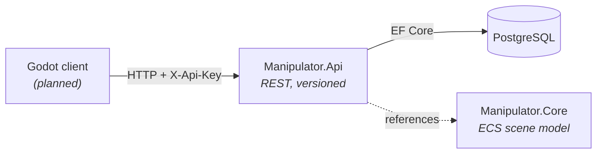
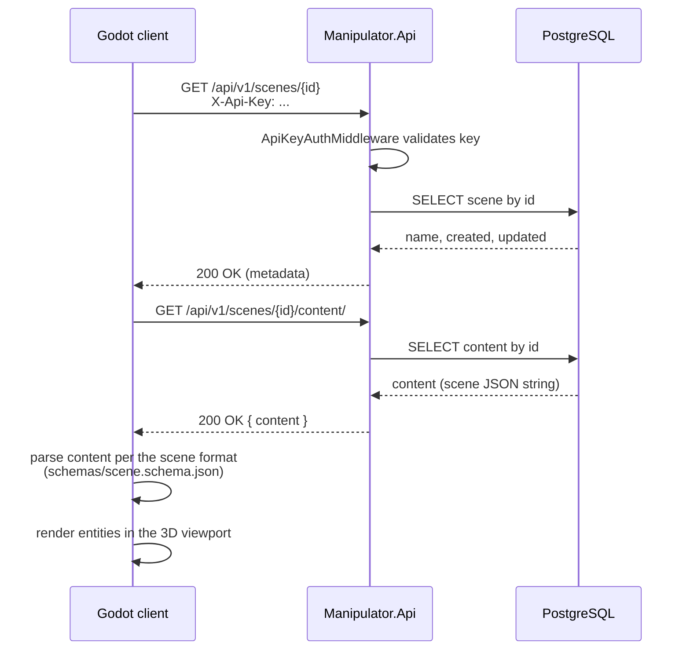

# Architecture

Simplified technical overview of the system. This is working documentation — coding
agents and reviewers should keep it current — and doubles as the basis for the thesis'
architecture chapter.

## Components

| Component | Responsibility |
|---|---|
| **Godot client** | 3D viewport for humans. Loads a scene from `Manipulator.Api`, renders entities, and (in later scope) sends edits back. Not yet implemented in this repo — a planned external client. |
| **`Manipulator.Core`** | Pure C# library: the ECS scene model (`Scene`, `Entity`, `IComponent`), the `CommandDispatcher`/`ICommandHandler` mutation pipeline, the `EventBus`, and `SceneSerializer` (scene ⇄ JSON, contract in `schemas/scene.schema.json`). No I/O, no network dependency — embeddable in any host. |
| **`Manipulator.Api`** | ASP.NET Core REST API. Owns scene persistence: CRUD over scene metadata and scene content, backed by PostgreSQL via EF Core. Versioned routes (`/api/v{version}/...`), API-key middleware on every request. |
| **PostgreSQL** | Durable storage for scenes (metadata + serialized content) owned exclusively by `Manipulator.Api`. |

`Manipulator.Core` is referenced by `Manipulator.Api`, but today the API stores scene
`Content` as an opaque string — it does not yet deserialize or validate it through
`SceneSerializer`. The ECS pipeline (`CommandDispatcher`, `EventBus`, live mutation) is
currently exercised by a separate host, `Manipulator.Mcp` + `Manipulator.Runner`, which
runs an in-memory `Scene` and exposes it to AI agents over MCP (Streamable HTTP) for
research/benchmarking. It has no database and no connection to `Manipulator.Api` — the
two hosts share the `Core` library, not runtime state. That path is out of scope for the
diagram below; see `dev/manipulator_design.md` for the fuller design history.

## Component diagram

## Request flow: loading a scene

## Related documents

- `dev/manipulator_design.md` — original design document; broader in scope than this file, partly superseded by the current implementation.
- `schemas/scene.schema.json` — JSON Schema for the scene content contract.
- `docs/api.md` (planned) — endpoint reference, auth, versioning, scene content contract.
- `docs/adr/` (planned) — architectural decision records.
